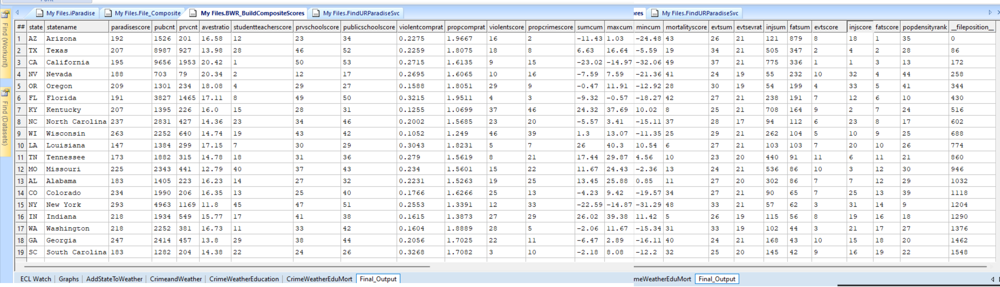

# Livability Index Project using HPCC Systems

This project builds a **composite livability index** using HPCC Systems and ECL programming language. The objective is to analyze multiple datasets (crime, health, education, transportation, weather, population density, etc.) to compute various sub-scores and combine them into an overall livability score for different locations.

---

## Datasets Used

* Crime Statistics
* Health Statistics
* Education Data (Schools)
* Transportation Data
* Weather Data
* Population Density Data

---

## Technologies Used

* **HPCC Systems** (Enterprise Control Language - ECL)
* **ECL IDE**
* **CSV data files**
* **Data Visualization using ECL & HPCC Visualization tools**

---

## Results

The project produces a livability index visualized.

---
